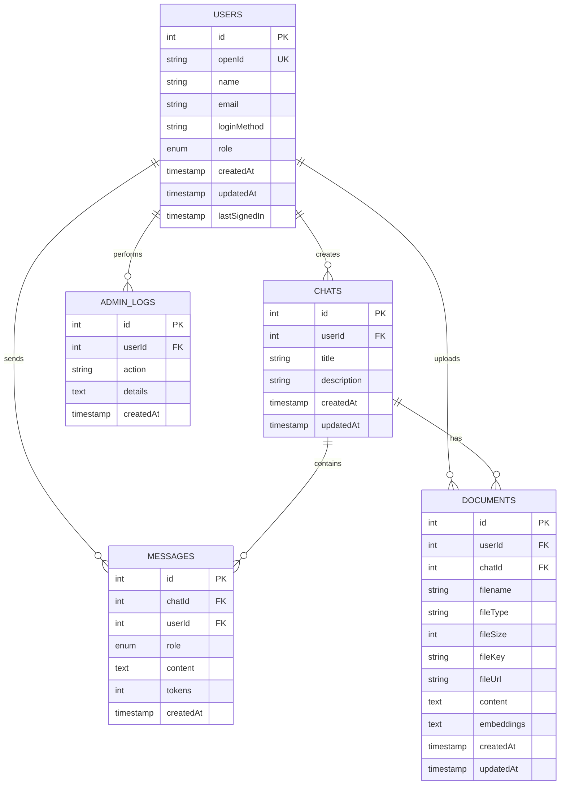

# OmniMind AI - Entity Relationship Diagram

## Database Schema



## Table Descriptions

### USERS
Stores user account information and authentication details.

| Column | Type | Constraints | Description |
|--------|------|-----------|-------------|
| id | INT | PRIMARY KEY, AUTO_INCREMENT | Unique user identifier |
| openId | VARCHAR(64) | UNIQUE, NOT NULL | Manus OAuth identifier |
| name | TEXT | | User's display name |
| email | VARCHAR(320) | | User's email address |
| loginMethod | VARCHAR(64) | | Login method (manus, google, etc.) |
| role | ENUM | NOT NULL, DEFAULT 'user' | User role (user, admin) |
| createdAt | TIMESTAMP | NOT NULL, DEFAULT NOW() | Account creation time |
| updatedAt | TIMESTAMP | NOT NULL, DEFAULT NOW() | Last update time |
| lastSignedIn | TIMESTAMP | NOT NULL, DEFAULT NOW() | Last login time |

### CHATS
Stores chat sessions for each user.

| Column | Type | Constraints | Description |
|--------|------|-----------|-------------|
| id | INT | PRIMARY KEY, AUTO_INCREMENT | Unique chat identifier |
| userId | INT | FOREIGN KEY, NOT NULL | Reference to user |
| title | VARCHAR(255) | NOT NULL | Chat title |
| description | TEXT | | Chat description |
| createdAt | TIMESTAMP | NOT NULL, DEFAULT NOW() | Chat creation time |
| updatedAt | TIMESTAMP | NOT NULL, DEFAULT NOW() | Last update time |

### MESSAGES
Stores individual messages within chats.

| Column | Type | Constraints | Description |
|--------|------|-----------|-------------|
| id | INT | PRIMARY KEY, AUTO_INCREMENT | Unique message identifier |
| chatId | INT | FOREIGN KEY, NOT NULL | Reference to chat |
| userId | INT | FOREIGN KEY, NOT NULL | Reference to user |
| role | ENUM | NOT NULL | Message role (user, assistant) |
| content | LONGTEXT | NOT NULL | Message content |
| tokens | INT | | Token count for LLM |
| createdAt | TIMESTAMP | NOT NULL, DEFAULT NOW() | Message creation time |

### DOCUMENTS
Stores uploaded documents for RAG analysis.

| Column | Type | Constraints | Description |
|--------|------|-----------|-------------|
| id | INT | PRIMARY KEY, AUTO_INCREMENT | Unique document identifier |
| userId | INT | FOREIGN KEY, NOT NULL | Reference to user |
| chatId | INT | FOREIGN KEY | Reference to chat (optional) |
| filename | VARCHAR(255) | NOT NULL | Original filename |
| fileType | VARCHAR(64) | NOT NULL | MIME type (pdf, docx, txt) |
| fileSize | INT | NOT NULL | File size in bytes |
| fileKey | VARCHAR(255) | NOT NULL | S3 storage key |
| fileUrl | VARCHAR(1024) | NOT NULL | Public file URL |
| content | LONGTEXT | | Extracted text content |
| embeddings | LONGTEXT | | Vector embeddings for RAG |
| createdAt | TIMESTAMP | NOT NULL, DEFAULT NOW() | Upload time |
| updatedAt | TIMESTAMP | NOT NULL, DEFAULT NOW() | Last update time |

### ADMIN_LOGS
Stores admin actions for audit trail.

| Column | Type | Constraints | Description |
|--------|------|-----------|-------------|
| id | INT | PRIMARY KEY, AUTO_INCREMENT | Unique log identifier |
| userId | INT | FOREIGN KEY, NOT NULL | Admin user reference |
| action | VARCHAR(255) | NOT NULL | Action performed |
| details | TEXT | | Action details |
| createdAt | TIMESTAMP | NOT NULL, DEFAULT NOW() | Log creation time |

## Relationships

### One-to-Many Relationships

1. **USERS → CHATS**: One user can have many chats
2. **USERS → MESSAGES**: One user can send many messages
3. **USERS → DOCUMENTS**: One user can upload many documents
4. **CHATS → MESSAGES**: One chat can have many messages
5. **CHATS → DOCUMENTS**: One chat can have many documents
6. **USERS → ADMIN_LOGS**: One admin can perform many actions

## Indexes

For optimal query performance, the following indexes are recommended:

```sql
-- User lookups
CREATE INDEX idx_users_openId ON users(openId);
CREATE INDEX idx_users_email ON users(email);

-- Chat queries
CREATE INDEX idx_chats_userId ON chats(userId);
CREATE INDEX idx_chats_createdAt ON chats(createdAt DESC);

-- Message queries
CREATE INDEX idx_messages_chatId ON messages(chatId);
CREATE INDEX idx_messages_userId ON messages(userId);
CREATE INDEX idx_messages_createdAt ON messages(createdAt DESC);

-- Document queries
CREATE INDEX idx_documents_userId ON documents(userId);
CREATE INDEX idx_documents_chatId ON documents(chatId);
CREATE INDEX idx_documents_fileKey ON documents(fileKey);
CREATE INDEX idx_documents_createdAt ON documents(createdAt DESC);

-- Admin log queries
CREATE INDEX idx_admin_logs_userId ON admin_logs(userId);
CREATE INDEX idx_admin_logs_createdAt ON admin_logs(createdAt DESC);
```

## Data Flow

```
User Login (OAuth)
    ↓
Create/Fetch User Record
    ↓
Create Chat Session
    ↓
Send Message → Store in MESSAGES
    ↓
Process with LLM
    ↓
Store Assistant Response in MESSAGES
    ↓
Optional: Upload Document → Store in DOCUMENTS
    ↓
Optional: Analyze Document with RAG
    ↓
Admin: View Analytics from aggregated data
```

## Scalability Considerations

1. **Message Archival**: Archive old messages to separate table after 6 months
2. **Document Cleanup**: Implement cleanup for unused documents
3. **Sharding**: Partition MESSAGES and DOCUMENTS tables by userId for horizontal scaling
4. **Caching**: Cache frequently accessed chats and recent messages in Redis
5. **Search**: Use Elasticsearch for full-text search on documents and messages
